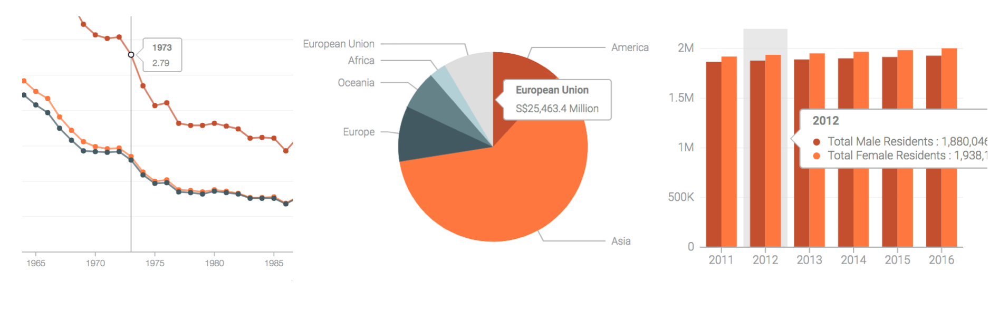
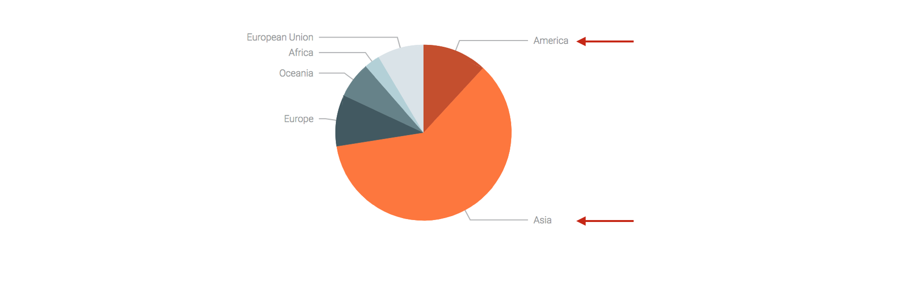
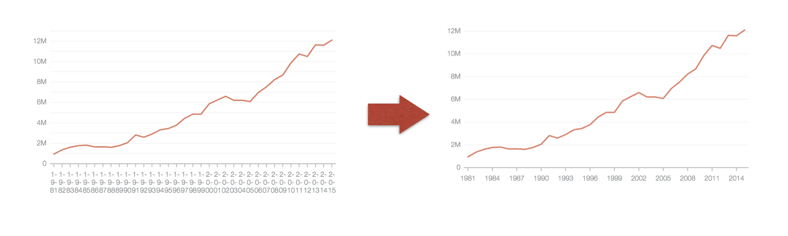

# datagovsg-plottable-charts

### Motivation
Generating a chart is easy, making it looks beautiful requires much more effort. Numerous charting libraries have been written to solves the basic problem of converting data to chart objects. Regardless of the library you choose, out-of-the-box defaults hardly produces the look you want.

Charts on Data.gov.sg are rendered using the [Plottable](http://plottablejs.org/) library. Based on D3, it is highly flexible and gives you many low level controls to fine-tune every single detail. However, this power comes at the price of additional configurations. We want to abstract away these configurations by creating wrappers that pre-apply all the styles we want on our component. That's why we created this library.


### What it does for you

##### Tooltips


##### Pie chart labels


##### Automatically downsample tick marks


##### And many more...


### How to use

##### Dependencies
- D3
- Plottable
- JQuery (optional, only if you require tooltip)

##### Use with bundler (Webpack, Rollup etc)
```bash
npm install --save datagovsg-plottable-charts
```

```html
<!-- html -->
<link rel="stylesheet" href="lib/plottable.css">
<link rel="stylesheet" href="lib/datagovsg-charts.css">
<!-- ... -->
<script src="lib/d3.min.js"></script>
<script src="lib/plottable.min.js"></script>
```

```javascript
/* js */
import {SimplePie} from 'datagovsg-plottable-charts'

// Instantiate the chart component
const pie = new SimplePie(props)

// Mount component
pie.mount(document.getElementById('ctn'))

// Update chart
pie.update(newProps)
```

###### Using plugins
```javascript
import {
  highlightOnHover,
  setupOuterLabel
} from 'datagovsg-plottable-charts/dist/plugins'

highlightOnHover(pie)
setupOuterLabel(pie)
```

##### Use without a bundler
```html
<!-- html -->
<script src="lib/datagovsg-charts.min.js"></script>
```

```javascript
/* js */
const {SimplePie, plugins} = DatagovsgCharts
const {highlightOnHover, setupOuterLabel} = plugins

const pie = new SimplePie(props)
highlightOnHover(pie)
setupOuterLabel(pie)
```


### Full Component List

##### Pre-styled
- [DatagovsgSimplePie](https://github.com/datagovsg/datagovsg-plottable-charts/blob/upgrade/src/index.js#L25)
- [DatagovsgSimpleBar](https://github.com/datagovsg/datagovsg-plottable-charts/blob/upgrade/src/index.js#L37)
- [DatagovsgHorizontalBar](https://github.com/datagovsg/datagovsg-plottable-charts/blob/upgrade/src/index.js#L59)
- [DatagovsgGroupedBar](https://github.com/datagovsg/datagovsg-plottable-charts/blob/upgrade/src/index.js#L80)
- [DatagovsgStackedBar](https://github.com/datagovsg/datagovsg-plottable-charts/blob/upgrade/src/index.js#L103)
- [DatagovsgLine](https://github.com/datagovsg/datagovsg-plottable-charts/blob/upgrade/src/index.js#L126)

##### Unstyled
- [SimplePie](https://github.com/datagovsg/datagovsg-plottable-charts/blob/upgrade/src/components/SimplePie.js)
- [SimpleBar](https://github.com/datagovsg/datagovsg-plottable-charts/blob/upgrade/src/components/SimpleBar.js)
- [GroupedBar](https://github.com/datagovsg/datagovsg-plottable-charts/blob/upgrade/src/components/GroupedBar.js)
- [StackedBar](https://github.com/datagovsg/datagovsg-plottable-charts/blob/upgrade/src/components/StackedBar.js)
- [MultipleLine](https://github.com/datagovsg/datagovsg-plottable-charts/blob/upgrade/src/components/MultipleLine.js)


### Full Plugin List
- [highlightOnHover](https://github.com/datagovsg/datagovsg-plottable-charts/blob/upgrade/src/plugins.js#L21)
- [setupTooltip](https://github.com/datagovsg/datagovsg-plottable-charts/blob/upgrade/src/plugins.js#L71)
- [setupPopover](https://github.com/datagovsg/datagovsg-plottable-charts/blob/upgrade/src/plugins.js#L133)
- [setupPopoverOnGuideLine](https://github.com/datagovsg/datagovsg-plottable-charts/blob/upgrade/src/plugins.js#L197)
- [setupShadowWithPopover](https://github.com/datagovsg/datagovsg-plottable-charts/blob/upgrade/src/plugins.js#L368)
- [customizeTimeAxis](https://github.com/datagovsg/datagovsg-plottable-charts/blob/upgrade/src/plugins.js#L463)
- [removeInnerPadding](https://github.com/datagovsg/datagovsg-plottable-charts/blob/upgrade/src/plugins.js#L480)
- [downsampleTicks](https://github.com/datagovsg/datagovsg-plottable-charts/blob/upgrade/src/plugins.js#L488)


### Useful helpers
- [DATAGOVSG_COLORS](https://github.com/datagovsg/datagovsg-plottable-charts/blob/upgrade/src/helpers.js#L13)
- [getScale](https://github.com/datagovsg/datagovsg-plottable-charts/blob/upgrade/src/helpers.js#L16)
- [getCategoryScale](https://github.com/datagovsg/datagovsg-plottable-charts/blob/upgrade/src/helpers.js#L21)
- [getColorScale](https://github.com/datagovsg/datagovsg-plottable-charts/blob/upgrade/src/helpers.js#L28)
- [getSingleColorScale](https://github.com/datagovsg/datagovsg-plottable-charts/blob/upgrade/src/helpers.js#L32)
- [getTimeScale](https://github.com/datagovsg/datagovsg-plottable-charts/blob/upgrade/src/helpers.js#L40)


### PivotTable


### Debugging guide

1. Clone the [datagovsg/datagovsg-plottable-charts](https://github.com/datagovsg/datagovsg-plottable-charts) repo
2. `cd` to the cloned repo
3. Run `npm install`
4. Change **main** field in the **package.json** to `"main": "src/index.js"`
5. Delete **module** field in the **package.json**
6. Set up a symlink `sudo npm link`
7. `cd` to your working directory
8. Run `npm link datagovsg-plottable-charts`
